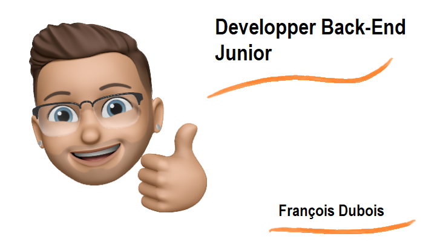

<h1> Hi there! </h1>

François Dubois, Back-end Developer 🚀

 

Passionate computer developer with expertise in C#, .NET, Python, and Django, complemented by strong skills in Unity and microcontrollers (Raspberry Pi, Arduino, ESP). 🐍🥰

 

My portfolio is being developed on django and in production on VSP.

It’s being improved. You can visit it here: http://45.132.242.27/

<h1>🛠️ Skills</h1>

<h2>Languages</h2>

<h2>Front-End Development</h2>

<h2>Frameworks</h2>

<h2>Database</h2>

<h2>Testing</h2>

<h2>Microcontrollers</h2>

<h2>IDE</h2>

<h2>Other</h2>

<h2>📫 How to reach me:</h2>

 

<!--
**Frantz680/Frantz680** is a ✨ _special_ ✨ repository because its `README.md` (this file) appears on your GitHub profile.

Here are some ideas to get you started:

- 🔭 I’m currently working on ...
- 🌱 I’m currently learning ...
- 👯 I’m looking to collaborate on ...
- 🤔 I’m looking for help with ...
- 💬 Ask me about ...
- 📫 How to reach me: ...
- 😄 Pronouns: ...
- ⚡ Fun fact: ...
-->
